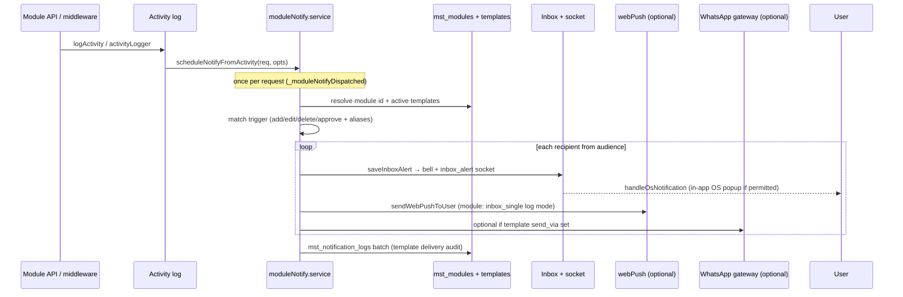

# Module notifications (activity → inbox / push / WhatsApp)

Module alerts are **not** fired from `accessControl` or deleted hooks. They run when an **activity log** is saved (`logActivity` or `activityLogger` middleware).

| | |
|---|---|
| **UI** | Settings → Notifications → **Module Templates** tab |
| **Route** | `/settings/notifications` (super_admin) |
| **Disable** | `MODULE_NOTIFY_FROM_ACTIVITY = false` at top of `moduleNotify.service.js` |
| **Deep doc (templates vars)** | Repo root `msg-template.md` |

---

## End-to-end flow

---

## What triggers a notify?

| Source | Function | When |
|--------|----------|------|
| Explicit log | `logActivity.js` | Controllers call `logActivity(req, { action, entity, … })` after save |
| Auto middleware | `activityLogger.js` | JSON responses that log activity also call `scheduleNotifyFromActivity` |

**Guards (no duplicate fire on same request):**

- `req._moduleNotifyDispatched` — second call skipped  
- `MODULE_NOTIFY_FROM_ACTIVITY === false` — off globally  
- `shouldSkipNotifyRequest` — skips notification-template / SOP / inbox entities  
- `success === false` — no notify  

**Standard triggers (DB + UI):** `add`, `edit`, `delete`, `approve` only.

**Sticker / packing example:** activity action `generate_stickers` maps to **`add`** via `ACTION_TRIGGER_ALIASES`; entity `boxes` can resolve module **`packing_entry`** when template lives on Packing Entry.

---

## Delivery channels

| Channel | Module template flag | Behaviour |
|---------|----------------------|-----------|
| **In-app bell** | `pwa_enabled` | `saveInboxAlert` + socket `inbox_alert`; client may show OS notification via socket handler |
| **Web push** | same | All linked devices tried; **Message Logs** for module use one row: **In-app notification** (`delivery_log: inbox_single`) |
| **WhatsApp** | `send_via` free/paid | `postWaMessage` if user has phone |
| **Email** | `email_enabled` | Stub — logged as skipped in template logs until gateway exists |

Task notifications use **`taskPwaPush.service.js`** — unchanged: per-device **Sent** rows in Message Logs, full push tracking.

---

## Message Logs (Settings → Logs tab)

| `log_source` | Table / origin | Shows |
|--------------|----------------|--------|
| `push` | `mst_push_delivery_log` | PWA push + module inbox row |
| `whatsapp` | `mst_activity_logs` (task notify module) | Free/paid sends |

Module PWA row recipient label: **`In-app notification`** (set in backend `inboxConfig.js` → `INBOX_DELIVERY_RECIPIENT_LABEL`; shown as-is in Message Logs).

Push statuses: **sent**, **failed**, **received**, **read** (no `skipped` on push delivery log).

---

## Backend file map

| File | Role |
|------|------|
| `backend/.../templates/moduleNotify.service.js` | **Main:** config, `scheduleNotifyFromActivity`, `dispatchModuleEvent`, audience, template vars, PWA/WA/email delivery |
| `backend/.../templates/notificationTemplate.model.js` | Template CRUD; `findActiveTemplatesByModuleId` |
| `backend/.../templates/notificationTemplateLog.model.js` | Batch insert module template delivery logs |
| `backend/.../templates/notificationTemplate.controller.js` | Admin API; uses `resolveAudience`, cache invalidation |
| `backend/.../templates/moduleRecordFieldsFromDb.js` | Record field hints for `{{variables}}` from `moduleTableMap` |
| `backend/.../inbox/inboxNotify.service.js` | `saveInboxAlert`, socket emit |
| `backend/.../push/webPush.service.js` | VAPID push; `inbox_single` log mode for module only |
| `backend/.../lib/config/notifications/inboxConfig.js` | App/trigger labels; `INBOX_DELIVERY_RECIPIENT_LABEL` |
| `backend/.../activity/logActivity.js` | Activity insert + schedule notify |
| `backend/.../middleware/activityLogger.js` | Response hook + schedule notify |
| `backend/.../middleware/accessControl.js` | Permissions only — **does not** send module notify |
| `backend/src/config/db/moduleTableMap.js` | Entity → table columns for template variable options |

**Removed (do not re-add):** `notifyFromActivityLog.js`, `moduleNotify.config.js` — logic merged into `moduleNotify.service.js`.

---

## Frontend file map

| File | Role |
|------|------|
| `frontend/.../notifications/Page.js` | Tabs: task templates, Send Message, **Logs**, **Module Templates** |
| `frontend/.../notifications/ModuleTemplatesTab.js` | List / CRUD entry |
| `frontend/.../notifications/NotificationTemplateModal.js` | Add/edit template, audience, triggers, variables |
| `frontend/.../notifications/moduleTemplateConfig.js` | Trigger options, audience helpers, `SYSTEM_VARIABLES`, defaults |
| `frontend/.../notifications/NotificationLogViewModal.js` | Log detail + timeline |
| `frontend/src/common/pwa/task/TaskBellMenu.js` | Bell count / list |
| `frontend/src/common/pwa/task/taskNotifySocket.js` | Socket → inbox + OS notify (module_* triggers) |
| `frontend/src/common/pwa/task/taskInboxActions.js` | Unread sync, mark read |

---

## Template variables (summary)

Built-in: `user_name`, `module_label`, `action_label`, `record_id`, `ref`, `summary`, `actor_name`, `date`, `time`, `datetime`, `template_name`.

Record fields: merged from request body, response, record, and `log_data.info` / `more` (see `buildModuleNotifyVars` in `moduleNotify.service.js`).

Syntax: `{{key}}` or `{key}` — same as task templates (`renderTemplate`).

---

## Config block (edit in one place)

Top of `moduleNotify.service.js`:

| Constant | Purpose |
|----------|---------|
| `MODULE_NOTIFY_FROM_ACTIVITY` | Master on/off |
| `SKIP_NOTIFY_ENTITIES` | Entities that never notify |
| `ACTION_TRIGGER_ALIASES` | e.g. `generate_stickers` → also `add` |
| `STICKER_NOTIFY_ACTIONS` | Route `boxes` → `packing_entry` module candidate |

Module resolution cache ~60s; template cache ~30s. `invalidateTemplateCache()` on template save.

---

## Regression checklist (task / push unchanged)

| Area | Expected |
|------|----------|
| Task assign / reminder / chat notify | `notification.service.js` + `taskPwaPush.service.js` — no `delivery_log: inbox_single` |
| Task Message Logs | Per-device PWA rows with Received/Read tracking |
| Manual Send Message tab | `push.controller` / `sendWebPushToUser` without inbox_single |
| Module sticker notify | One **In-app notification** log row per user per event; bell + optional push |
| Bell count | Module alerts included; socket filter respects app scope |
| Permissions | Still only `accessControl`; notify is side effect of activity log |

---

## Smoke test (after backend restart)

1. **Module:** Packing Entry template, trigger **Add**, audience = test user, PWA on.  
2. Run action that logs `generate_stickers` (or normal edit on a module with **Edit** template).  
3. Recipient sees bell (+ popup if browser permission).  
4. Settings → Logs: one **Sent** row, recipient **In-app notification**, template `module_<id>`.  
5. **Task:** Assign task — Logs still show device rows (e.g. Windows Chrome), not only inbox row.  
6. Toggle `MODULE_NOTIFY_FROM_ACTIVITY = false` — activity still logs, no module delivery.

---

## Related

- [notifications.md](./notifications.md) — task templates, send message, shared tables  
- [msg-template.md](../../../../msg-template.md) — operator guide for template authoring  
