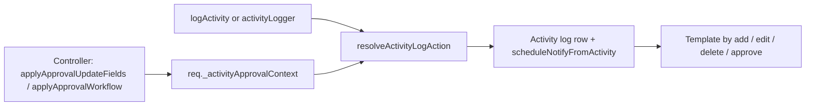

## v4.4.3 — IMS Forwarding Note · over-dispatch % base · live bill date range · RM Issue Request coils

### 28 Sep 2026

| Topic | Summary |
|-------|---------|
| **Over-dispatch %** | Tolerance extra is calculated on **total schedule qty**, not remaining balance |
| **Example** | Schedule 1000, balance 1000, 10% → max allowed dispatch **1100** (not balance + 10% of balance only) |
| **Config** | Unchanged: `forwarding_shortage_qty_percentage` in IMS App Configuration |
| **Live bills (`invfnote`)** | List date filter and bill dropdown now pass **billdt** range to the IMS internal API |
| **Default IMS window** | No dates sent → internal API still returns its default (~15 days) |
| **Save bill** | Assign API uses **bill date** (or optional body dates) for IMS fetch when validating green bills |
| **RM Issue Request Left = 0** | Coil **list** SQL omitted MRN `sticker_approved` → MRN portal coils failed eligibility; Left stayed 0 while Inventory Issuable was fine |

---

## 1. Forwarding Note — over-dispatch tolerance %

### Why

With `forwarding_shortage_qty_percentage > 0`, the hidden cap used **remaining schedule balance** as the percentage base. Business rule is **total scheduled quantity** for that Sch + item.

### Formula (when % > 0)

| Piece | Rule |
|-------|------|
| Extra qty | `floor(total_schedule × pct / 100)` |
| Tolerance cap | `balance + extra` (balance = schedule − already dispatched on that Sch/item) |
| Allowed max | Unchanged: `max(tolerance cap, standard FIFO qty at balance, current Std QTY on row)` |
| % = 0 | Unchanged: FIFO at balance; full-box overshoot allowed; backend skips max-allowed check |

### Example (10%)

| Total schedule | Already dispatched | Balance | Extra (10% of schedule) | Tolerance cap |
|---------------:|-------------------:|--------:|------------------------:|--------------:|
| 1000 | 0 | 1000 | 100 | **1100** |
| 1000 | 900 | 100 | 100 | **200** (total dispatch ceiling still 1100) |

### Backend

| Location | Change |
|----------|--------|
| `forwardingNoteItemsWrite.js` → `assertScheduleDispatchWithinBalance` | `maxExtraQty` uses `scheduleQty` instead of `balanceQty` |

### Frontend

| Location | Change |
|----------|--------|
| `ForwardingModal.js` → `getScheduleMaxExtraQty` | Percentage base: `schedule_qty` / `totalqty` / `total_qty` on the row; if missing, falls back to balance (same as before for that row) |
| Schedule hydrate / catalog / item pick | Carries `schedule_qty` from schedule API where already available (no new API) |

FIFO targets, balance column, approval, and `% = 0` behaviour are unchanged.

---

## 2. Forwarding Note — live bills and list date filter

### Problem

IMS internal API for **`invfnote`** returns about **15 days** of data when no date filter is sent. The Forwarding Note list **did** filter DB rows by `from_date` / `to_date`, but live bill merge and the **Bill** dropdown still called IMS without a range. Older FN lines looked blank for live **Bill No.** / bill list even when bills existed in ERP.

### Fix

When the user sets a date range on Forwarding Note (master list), that range is turned into the same IMS filter shape already used elsewhere:

`billdt >= '2Apr2026' and billdt <= '6Aug2026'`

(Gate Entry helpers: `parseBillDateHint`, `buildImsBilldtRangeFilter`.)

| When | IMS call |
|------|----------|
| No from/to | No filter → default ~15-day IMS behaviour |
| From and/or to set | Filter sent on `invfnote` fetch |

### API / data flow

| Endpoint | Dates source | IMS usage |
|----------|--------------|-----------|
| `POST /forwarding-notes/list` | `filters.from_date`, `filters.to_date` | Summary live bill merge |
| `POST /forwarding-notes/list-items` | Same | Item-wise live bill merge |
| `POST /forwarding-notes/bill-helper` | `from_date`, `to_date` in body | Bill dropdown options |
| `POST /forwarding-notes/assign-item-bill` | `billdt` / `bill_dt`, or `from_date` / `to_date` | Validate bill is green in IMS before save |

List filters still apply to **Postgres** (`created_at` etc.) as before. IMS filter applies to **bill date** on live `invfnote` rows.

### Frontend

| Location | Change |
|----------|--------|
| `ForwardingPage.js` | Passes current list `fromDate` / `toDate` into bill dropdown fetch and bill lookup |
| `forwardingBillOptions.js` | Sends `from_date` / `to_date` (with `00:00:00` / `23:59:59`) on `getBillNumbers` |

### Backend plumbing

| Location | Change |
|----------|--------|
| `forwardingNote.controller.js` | Builds IMS filter from dates; passes into enrich + bill-helper + assign |
| `forwardingNoteList.js` | `resolveForwardingBillClaims(invfnoteFilter)` → `fetchExternalRecords(..., filter)` |
| `externalDataMerge.js` | Optional IMS `filter` on fetch; cache key includes filter so ranges do not clash |

### Unchanged

- DB schema, bill save columns, print bill (still saved `bill_no` / `bill_dt` only)
- Bill match keys, green/red rules, attached DB bills always shown
- Dispatch plan tab, FIFO modal logic (except over-dispatch % base above)

### Operator note

Pick a **bill date range** that covers when invoices were raised. If the list shows old FNs but bills are outside the selected billdt window, live bills may still not appear until the filter includes those bill dates.

---

## 3. Module notifications — approve vs add/edit (log pipeline)

### 28 Sep 2026

| Topic | Summary |
|-------|---------|
| **Goal** | Training & SOP **notification templates** (add / edit / delete / approve) fire from the **same activity log** path — no new notify routes or architecture |
| **Problem** | Authorize often goes through **update/create** routes; notify saw **edit** or **add** instead of **approve**, or `[add]` with no ADD template configured |
| **Approach** | Resolve the real event **inside `logActivity`** (and middleware logger), using approval workflow context on `req` |

### How it works

| Step | Location | Behaviour |
|------|----------|-----------|
| 1 | `approval.js` → `applyApprovalWorkflow` | After authorize / pending logic, sets **`req._activityApprovalContext`**: `incomingApproved`, `alreadyApproved`, `hasBusinessChanges`, `appliedApprove` |
| 2 | `logActivity.js` → `resolveActivityLogAction` | If context says authorize applied → action **`approve`**; else create/update stay **add** / **edit**; optional fallbacks: `req.body.approved`, `opts.existing`, `opts.incomingApproved`, `details.old_values` |
| 3 | `logActivity.js` → `logActivity` | Writes **`action_type`** and calls **`scheduleNotifyFromActivity`** with the **resolved** action; clears context after one log; notify errors **do not** fail the API |
| 4 | `activityLogger.js` | Same resolver for routes that log only via middleware (no duplicate when `req._activityLogged`) |

### Resolved action rules (CRUD)

| User action | Typical controller `action` | Resolved notify event |
|-------------|----------------------------|------------------------|
| Create draft | `create` | **add** |
| Create + authorize (same request) | `create` + workflow | **approve** |
| Edit only | `update` + workflow (no authorize) | **edit** |
| Edit + first-time authorize | `update` + workflow | **approve** |
| Delete | `delete` | **delete** |
| Already logs `approve` (many RM modules) | `approve` | **approve** (unchanged) |

### `logActivity` options (optional hints)

| Option | Role |
|--------|------|
| **`existing`** | Row **before** save — fallback “was already approved?” when context is missing |
| **`record`** | **After** save — activity log description / `log_data` (e.g. enriched FN) |
| **`responseData`** | Same shape as API response — **notification template** variables (`buildModuleNotifyVars`); if omitted, `record` is used |

Passing the same enriched object as both `record` and `responseData` is **redundant but safe**; one is enough if identical.

### Templates (Training & SOP grid)

| Grid column | `trigger_events` value |
|-------------|------------------------|
| ADD | `add` |
| EDIT | `edit` |
| DELETE | `delete` |
| AUTHORIZE | `approve` |

Console message **`no template trigger matched events [add]`** means: action was **add**, but no active **ADD** template exists (e.g. only AUTHORIZE configured). Either add an ADD template or authorize on create/edit so the event is **approve**.

### Backend files (this change)

| File | Change |
|------|--------|
| `backend/src/platform/utils/auth/approval.js` | Stamp **`_activityApprovalContext`** in workflow only |
| `backend/src/platform/utils/activity/logActivity.js` | **`resolveActivityLogAction`** + resolve before log/notify |
| `backend/src/platform/middleware/activityLogger.js` | Import resolver from `logActivity.js` |

No DB schema, template API, or UI contract changes.

### Smoke test (after backend restart)

1. **Forwarding Note** — create draft → activity **CREATE**; notify only if **ADD** template exists.  
2. **Forwarding Note** — create or update with **Authorize** → **APPROVE** + authorize template.  
3. Any module using standard approval helpers — edit-only vs authorize-only once each.

---

## 4. RM Store — Issue Request Left = 0 (MRN coils)

### 28 Sep 2026

| Topic | Summary |
|-------|---------|
| **Symptom** | New Issue Request: **Left = 0**, Coils locked at 0; RM Inventory showed **Issuable** stock (e.g. W18A4.04 / MRN `4186_2`) |
| **Cause** | `available-coils` loads coils via `findCoils` **list** select, then filters with `isCoilEligibleForIssueRequest`. For MRN portal coils that requires `sticker_approved === true`, but **`COIL_LIST_SELECT` did not select** `m.sticker_approved` / `m.sticker_generated` → field always missing → every MRN coil rejected |
| **Why SA / other issues still worked** | Stock Adjustment (**SA Add**) coils skip the sticker gate (QC / adjustment approve only). MRN Portal stock hit the broken path |
| **Why Inventory looked OK** | Issuable = warehouse + QC passed; it does **not** use the same list-row sticker field as Issue Request available-coils |

### Fix

| Location | Change |
|----------|--------|
| `backend/src/apps/rmstore/modules/coil/models/coil.model.js` → `COIL_LIST_SELECT` | Add `m.sticker_generated`, `m.sticker_approved` (already on `COIL_DETAIL_SELECT`) |

No DB schema change. No frontend change. Eligibility rules unchanged — list rows now carry the fields the rule already expected.

### Tables involved

| Table | Role |
|-------|------|
| `rmstore_coil_table` | Coils (qty, location, status, `mrn_uid`, `sa_id`) |
| `rmstore_mrn` | Source of `sticker_approved` / `sticker_generated` (`JOIN` on `mrn_uid`) |
| `rmstore_qc_check` | QC status used with sticker for Issue eligibility |
| `rmstore_issue_request` / `rmstore_issue_request_job_card` | Issue Request + coil reserve (unchanged by this fix) |
